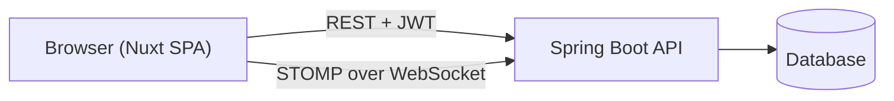

# 01 — Overview

> See also: [02 — Module Structure](02-module-structure.md), [06 — External Integrations](06-external-integrations.md).

`matches-dashboard` is the web frontend for an amateur boxing tournament platform. It is a single Nuxt 4 application that ships as static files and talks to a separate Spring Boot REST + WebSocket backend.

## Two audiences, one bundle

| Audience       | URL prefix                | Auth          | Purpose                                                                 |
|----------------|---------------------------|---------------|-------------------------------------------------------------------------|
| Administrators | `/admin/**`, `/login`     | JWT in `localStorage` | CRUD over athletes, tournaments, registrations, matches, configuration. |
| Public users   | `/public/**`              | none          | Athlete self-registration wizard and live scoreboard for spectators.    |

The root `/` redirects: authenticated → `/admin`, otherwise → `/login`. The decision lives in `app/middleware/auth.global.ts` (a *global route middleware* — a function Nuxt runs before every navigation, ≈ Express middleware for the SPA router).

## What this repo does — and does not

This is a **thin client**:

- It renders UI, validates input with [Zod](https://zod.dev) schemas, and issues HTTP/WS calls.
- It does **not** own any business rules, persistence, or authentication logic — those all live in the Spring Boot API.
- It does **not** run a Node server in production. `nuxt.config.ts` has `ssr: false`, so `pnpm build` produces static `.html`/`.js`/`.css` files in `.output/public/` that are served by `nginx` in the Docker image.

## Top-level architecture

All admin pages flow through one HTTP helper (`useApi()`, see [06](06-external-integrations.md)) that attaches a JWT bearer token from `localStorage`. The public scoreboard additionally opens a STOMP-over-WebSocket connection that triggers REST refetches when the backend publishes a "matches changed" event (the *notify-then-refetch* pattern in [10](10-notable-patterns.md)).

## Why static SPA, not SSR

The choice of `ssr: false` matters because it removes a whole class of decisions:

- No server-side data fetching, no hydration mismatch concerns.
- `runtimeConfig.public.apiBase` is **baked into the bundle at build time** — there is no Node process at runtime to re-read environment variables. To point at a different backend, you rebuild with a different `NUXT_PUBLIC_API_BASE`.
- Deployment is just static hosting + a tiny `nginx` config (see [03](03-build-run-test.md)).
