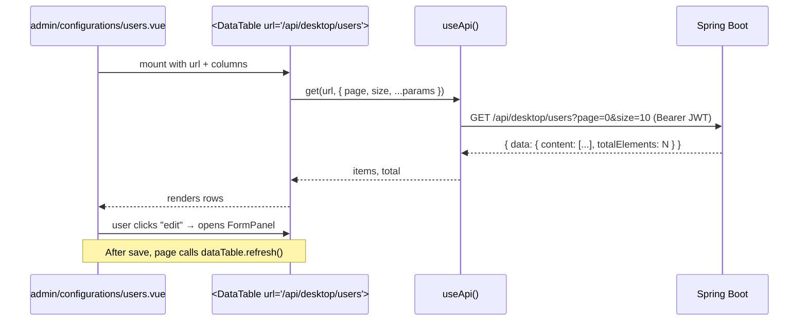

# 05 — Data Flow

> See also: [06 — External Integrations](06-external-integrations.md), [10 — Notable Patterns](10-notable-patterns.md).

A Vue *composable* is a function (conventionally named `use…`) that encapsulates reactive state and behavior — analogous to a React hook. Vue's *reactive primitives* are `ref<T>()` (a mutable, observable cell, ≈ a one-cell observable), `computed()` (a derived value that recalculates when its dependencies change), and `watch()` (a callback when a watched value changes).

This chapter shows how a typical screen — a paginated list — gets its data.

## The end-to-end path



## Step 1 — the page composes a table

A typical admin page is small. It defines columns, passes a URL, and listens for a `saved` event from the form panel.

```vue
<!-- shape of every admin list page -->
<DataTable ref="dataTable" :url="'/api/desktop/users'" :columns="columns" />
<UserFormPanel :open="open" :item="editing" @saved="dataTable?.refresh()" @closed="open = false" />
```

## Step 2 — `DataTable` fetches reactively

`app/components/DataTable.vue` is generic over the row type. It owns the reactive page state and uses `useLazyAsyncData` (a Nuxt composable that wraps a fetcher, returns `data`/`status`/`refresh`, and does not block navigation while loading).

```ts
// app/components/DataTable.vue
const page = ref(1)
const selectedPageSize = ref(props.pageSize)
const searchInput = ref('')   // bound to the search <UInput>
const search = ref('')        // debounced copy — sent to the server

const { data, refresh, status } = useLazyAsyncData(
  `data-table-${instanceId}`,
  () => api.get<{ data: { content: T[], totalElements: number } }>(props.url, {
    page: page.value - 1,
    size: selectedPageSize.value,
    search: search.value || undefined,
    ...props.params,
  }),
)

// debounce: wait 300 ms after the last keystroke, then refresh
watch(searchInput, (val) => {
  clearTimeout(searchTimer)
  searchTimer = setTimeout(() => {
    search.value = val
    page.value !== 1 ? (page.value = 1) : refresh()
  }, 300)
})

watch(page, () => refresh())
watch(selectedPageSize, () => { /* reset to page 1 or refresh */ })
watch(() => props.params, () => { /* same */ }, { deep: true })
```

Four things to notice:

1. **Reactive dependencies are explicit.** Changing `page`, `selectedPageSize`, `search`, or `props.params` triggers `refresh()`. Vue's reactivity tracks `.value` reads, but `useLazyAsyncData` does not auto-rerun on dependency change — the explicit `watch` calls do that.
2. **Search is debounced, not throttled.** Setting `page` to 1 from inside the debounce callback fires the `page` watcher, which calls `refresh()` — so the debounce only calls `refresh()` directly when the user is already on page 1.
3. **The data shape is the Spring Boot `Page<T>` envelope:** `{ data: { content, totalElements } }`. See [07](07-domain-models.md).
4. **`refresh` is re-exposed to the parent** via `defineExpose({ refresh, ... })`. This is what lets a `FormPanel` parent call `dataTable?.refresh()` after a save.

## Step 3 — a form panel mutates and emits

Every form panel (`UserFormPanel`, `AthleteFormPanel`, …) is a `USlideover` (a right-side drawer) wrapping a `UForm` validated against a Zod schema. On submit it calls `POST` / `PUT` via `useApi()`, then emits `saved`. It does **not** know about the table — decoupling the two via an event keeps the panel reusable from anywhere.

## Reactive state, not a store

There is no Pinia / Vuex / Redux. Application-wide state (the JWT, the current user, UI color preference) is held in `useState` cells (a Nuxt composable that creates SSR-safe shared refs by key). For an SPA without SSR, `useState('auth-token')` is functionally a singleton `ref` keyed by string — any component that calls `useState('auth-token')` gets the same cell.

```ts
// app/composables/useAuth.ts
const token = useState<string | null>('auth-token', () => {
  if (import.meta.client) { return localStorage.getItem('auth-token') }
  return null
})
```

The factory function is only called once per key per app instance, so reads are cheap.

## Realtime: notify, then refetch

The public scoreboard is the only screen that uses live updates. It subscribes to a STOMP topic and, on every message, calls `fetchMatches()` again — **the message body is ignored**. This keeps the client trivially consistent: REST is the single source of truth; the WebSocket is just a tap on the shoulder. See [06](06-external-integrations.md) and [10](10-notable-patterns.md).
