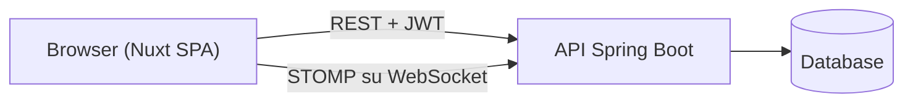

# 01 — Panoramica

> Vedi anche: [02 — Struttura dei Moduli](02-module-structure.md), [06 — Integrazioni Esterne](06-external-integrations.md).

`matches-dashboard` è il frontend web di una piattaforma per tornei di pugilato amatoriale. È una singola applicazione Nuxt 4 distribuita come file statici, che dialoga con un backend Spring Boot REST + WebSocket separato.

## Due tipi di utenza, un unico bundle

| Utenza             | Prefisso URL              | Auth          | Scopo                                                                       |
|--------------------|---------------------------|---------------|-----------------------------------------------------------------------------|
| Amministratori     | `/admin/**`, `/login`     | JWT in `localStorage` | CRUD su atleti, tornei, iscrizioni, match, configurazioni.          |
| Utenti pubblici    | `/public/**`              | nessuna       | Wizard di auto-iscrizione per atleti e scoreboard live per il pubblico.     |

La rotta `/` reindirizza: utente autenticato → `/admin`, altrimenti → `/login`. La decisione vive in `app/middleware/auth.global.ts` (un *middleware di rotta globale* — una funzione che Nuxt esegue prima di ogni navigazione, ≈ un middleware Express per il router della SPA).

## Cosa fa — e cosa non fa — questo repo

È un **client leggero**:

- Renderizza la UI, valida l'input tramite schemi [Zod](https://zod.dev) ed effettua chiamate HTTP/WS.
- Non contiene logica di business, persistenza o autenticazione — tutto questo vive nell'API Spring Boot.
- Non esegue un server Node in produzione. `nuxt.config.ts` ha `ssr: false`, quindi `pnpm build` produce file statici `.html`/`.js`/`.css` in `.output/public/` serviti da `nginx` nell'immagine Docker.

## Architettura ad alto livello

Tutte le pagine admin passano da un unico helper HTTP (`useApi()`, vedi [06](06-external-integrations.md)) che aggiunge il bearer JWT dal `localStorage`. Lo scoreboard pubblico apre inoltre una connessione STOMP-su-WebSocket che innesca un nuovo fetch REST quando il backend pubblica un evento "match modificati" (il pattern *notify-then-refetch* descritto in [10](10-notable-patterns.md)).

## Perché SPA statica e non SSR

La scelta `ssr: false` è importante perché rimuove un'intera classe di decisioni:

- Niente fetch lato server, niente problemi di hydration mismatch.
- `runtimeConfig.public.apiBase` viene **incorporato nel bundle al momento della build** — non c'è alcun processo Node in esecuzione che legga le variabili d'ambiente. Per puntare a un backend diverso si fa una nuova build con `NUXT_PUBLIC_API_BASE` diverso.
- Il deploy è solo hosting statico + una piccola configurazione `nginx` (vedi [03](03-build-run-test.md)).
