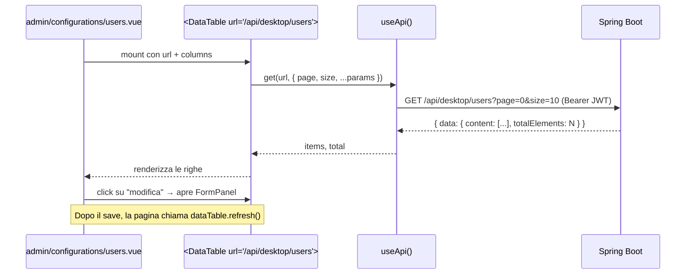

# 05 — Flusso dei Dati

> Vedi anche: [06 — Integrazioni Esterne](06-external-integrations.md), [10 — Pattern Ricorrenti](10-notable-patterns.md).

Una *composable* Vue è una funzione (per convenzione chiamata `use…`) che incapsula stato reattivo e comportamento — analogo a un hook di React. Le *primitive reattive* di Vue sono `ref<T>()` (una cella mutabile e osservabile, ≈ un observable a singola cella), `computed()` (un valore derivato che si ricalcola quando cambiano le sue dipendenze) e `watch()` (una callback eseguita quando cambia un valore osservato).

Questo capitolo mostra come una pagina tipica — una lista paginata — ottiene i propri dati.

## Il flusso end-to-end



## Step 1 — la pagina compone una tabella

Una pagina admin tipica è piccola. Definisce le colonne, passa un URL e ascolta l'evento `saved` dal form panel.

```vue
<!-- forma di ogni pagina admin di tipo lista -->
<DataTable ref="dataTable" :url="'/api/desktop/users'" :columns="columns" />
<UserFormPanel :open="open" :item="editing" @saved="dataTable?.refresh()" @closed="open = false" />
```

## Step 2 — `DataTable` fa il fetch in modo reattivo

`app/components/DataTable.vue` è generico sul tipo della riga. Possiede lo stato reattivo di pagina e usa `useLazyAsyncData` (una composable Nuxt che incapsula un fetcher, restituisce `data`/`status`/`refresh` e non blocca la navigazione mentre carica).

```ts
// app/components/DataTable.vue
const page = ref(1)
const selectedPageSize = ref(props.pageSize)
const searchInput = ref('')   // legato all'<UInput> di ricerca
const search = ref('')        // copia con debounce — inviata al server

const { data, refresh, status } = useLazyAsyncData(
  `data-table-${instanceId}`,
  () => api.get<{ data: { content: T[], totalElements: number } }>(props.url, {
    page: page.value - 1,
    size: selectedPageSize.value,
    search: search.value || undefined,
    ...props.params,
  }),
)

// debounce: attende 300 ms dopo l'ultimo tasto, poi fa il refresh
watch(searchInput, (val) => {
  clearTimeout(searchTimer)
  searchTimer = setTimeout(() => {
    search.value = val
    page.value !== 1 ? (page.value = 1) : refresh()
  }, 300)
})

watch(page, () => refresh())
watch(selectedPageSize, () => { /* reset a pagina 1 o refresh */ })
watch(() => props.params, () => { /* idem */ }, { deep: true })
```

Quattro cose da notare:

1. **Le dipendenze reattive sono esplicite.** Cambiare `page`, `selectedPageSize`, `search` o `props.params` innesca `refresh()`. La reattività di Vue traccia le letture di `.value`, ma `useLazyAsyncData` non si riesegue automaticamente al cambio delle dipendenze — sono i `watch` espliciti a farlo.
2. **La ricerca usa il debounce, non il throttle.** Impostare `page` a 1 dall'interno del callback del debounce fa scattare il watcher di `page`, che chiama `refresh()` — il debounce chiama `refresh()` direttamente solo se l'utente è già a pagina 1.
3. **La forma dei dati è l'envelope `Page<T>` di Spring Boot:** `{ data: { content, totalElements } }`. Vedi [07](07-domain-models.md).
4. **`refresh` viene riesposto al genitore** tramite `defineExpose({ refresh, ... })`. È questo che permette al genitore con un `FormPanel` di chiamare `dataTable?.refresh()` dopo un save.

## Step 3 — un form panel modifica ed emette

Ogni form panel (`UserFormPanel`, `AthleteFormPanel`, …) è una `USlideover` (drawer laterale destro) che avvolge una `UForm` validata da uno schema Zod. Al submit chiama `POST` / `PUT` tramite `useApi()`, poi emette `saved`. **Non** sa nulla della tabella — disaccoppiarli tramite un evento mantiene il panel riusabile da qualsiasi punto.

## Stato reattivo, non uno store

Niente Pinia / Vuex / Redux. Lo stato globale dell'applicazione (il JWT, l'utente corrente, la preferenza di colore della UI) è tenuto in celle `useState` (una composable Nuxt che crea ref condivisi SSR-safe chiavati per stringa). Per una SPA senza SSR, `useState('auth-token')` è funzionalmente un singleton di `ref` chiavato per stringa — qualsiasi componente che chiama `useState('auth-token')` ottiene la stessa cella.

```ts
// app/composables/useAuth.ts
const token = useState<string | null>('auth-token', () => {
  if (import.meta.client) { return localStorage.getItem('auth-token') }
  return null
})
```

La funzione factory viene invocata una sola volta per chiave per istanza dell'app, quindi le letture sono economiche.

## Realtime: notify, poi refetch

Lo scoreboard pubblico è l'unica schermata che usa aggiornamenti live. Si sottoscrive a un topic STOMP e, ad ogni messaggio, chiama di nuovo `fetchMatches()` — **il body del messaggio viene ignorato**. Questo mantiene il client banalmente coerente: REST è l'unica fonte di verità; il WebSocket è solo un colpetto sulla spalla. Vedi [06](06-external-integrations.md) e [10](10-notable-patterns.md).
